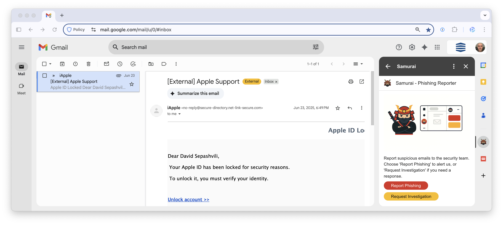

# Samurai - Gmail Phishing Reporter

A simple Gmail add-on that helps users report suspicious emails to their security team with one click. When a user reports an email, it's automatically forwarded as an .eml attachment to the security team, preserving all headers for forensic analysis.

## Features

- **Two reporting options**:
  - **Report Phishing** - Alert security team about suspicious emails (no response expected)
  - **Request Investigation** - Ask security team to investigate and respond back
- **Full email preservation** - Emails are forwarded as .eml attachments with all headers intact
- **Clean reports** - Security team receives structured reports with key information highlighted
- **No external dependencies** - Runs entirely within Google Workspace
- **Minimal permissions** - Only requests necessary Gmail access

## Installation
## 📋 Installation

Ready to deploy Samurai in your organization? Follow our comprehensive [Installation Guide](INSTALL.md) for step-by-step instructions.

## How It Works

1. User selects a suspicious email in Gmail
2. Clicks on Samurai in the Gmail sidebar
3. Chooses:
   - "Report Phishing" - To alert security team
   - "Request Investigation" - To request investigation with response
4. Email is automatically forwarded to security team
5. User sees confirmation:
   - Phishing reports: "Thank you, security team notified"
   - Investigation requests: "Security team will contact you soon"

## What Security Teams Receive

Each report includes:
- Original email as .eml attachment (preserves all headers and content)
- Enhanced report summary with:
  - Reporter's email and timestamp
  - Complete email metadata (sender, recipient, reply-to, subject, date)
  - Message tracking information (Message-ID, User-Agent when available)
  - List of attachments (if any)
  - Reply-To field highlighted if different from sender (common phishing indicator)
- For investigation requests: Clear indicator that user expects a response

## Security

- No data is stored or sent outside your Google Workspace
- All processing happens within Gmail
- Minimal OAuth scopes requested
- Simple, auditable codebase
